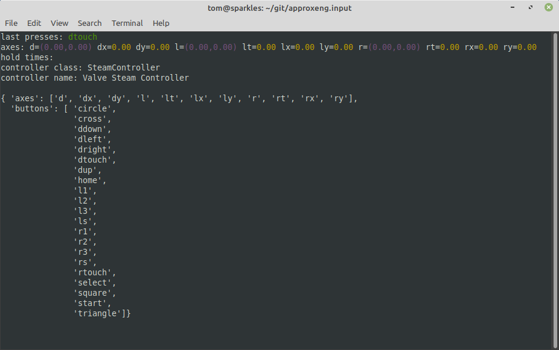

Command-line tools
==================

When installed, this library provides a set of command-line tools. Note that if you're running in a virtual environment
you'll need to activate the environment before these are available. They can be run like any other command from a
terminal, and do not require a windowing system so you should be able to run these remotely over SSH, for example.

Interactive controller test
---------------------------

The `approxeng_input_show_controls` tool will wait for the first controller to connect, then show a curses-based GUI
where you can test reception of axis and button events. It's also a good way to check that a newly profiled controller
is behaving as expected. In previous versions of the library this was something you could run from the `scripts`
directory in the source, it's been moved to work for anyone installing the library through pip.

.. code-block:: bash

    > approxeng_input_show_controls

With a controller connected, this will display something like the following:

Profile a new controller
------------------------

If you've got a relatively simple controller but one that's not already recognised by the library,
the profiling tool allows you to create a configuration interactively. See :ref:`profiling` for more details.

.. code-block:: bash

    > approxeng_input_profile

List available devices
----------------------

As a quick check to see what joystick-like devices exist on your system, you can do this:

.. code-block:: bash

    > approxeng_input_list_devices
    { 'axes': { 'ABS_HAT0X': { 'code': 16,
                               'flat': 0,
                               'fuzz': 256,
                               'max': 32767,
                               'min': -32767,
                               'res': 1638},
                'ABS_HAT0Y': { 'code': 17,
                               'flat': 0,
                               'fuzz': 256,
                               'max': 32767,
                               'min': -32767,
                               'res': 1638},
                'ABS_HAT2X': {'code': 20, 'flat': 0, 'fuzz': 0, 'max': 255, 'min': 0, 'res': 51},
                'ABS_HAT2Y': {'code': 21, 'flat': 0, 'fuzz': 0, 'max': 255, 'min': 0, 'res': 51},
                'ABS_RX': {'code': 3, 'flat': 0, 'fuzz': 256, 'max': 32767, 'min': -32767, 'res': 1638},
                'ABS_RY': {'code': 4, 'flat': 0, 'fuzz': 256, 'max': 32767, 'min': -32767, 'res': 1638},
                'ABS_X': {'code': 0, 'flat': 0, 'fuzz': 0, 'max': 32767, 'min': -32767, 'res': 51},
                'ABS_Y': {'code': 1, 'flat': 0, 'fuzz': 0, 'max': 32767, 'min': -32767, 'res': 51}},
      'bus': 3,
      'buttons': { 289: 'BTN_THUMB',
                   290: 'BTN_THUMB2',
                   304: ['BTN_A', 'BTN_GAMEPAD', 'BTN_SOUTH'],
                   305: ['BTN_B', 'BTN_EAST'],
                   307: ['BTN_NORTH', 'BTN_X'],
                   308: ['BTN_WEST', 'BTN_Y'],
                   310: 'BTN_TL',
                   311: 'BTN_TR',
                   312: 'BTN_TL2',
                   313: 'BTN_TR2',
                   314: 'BTN_SELECT',
                   315: 'BTN_START',
                   316: 'BTN_MODE',
                   317: 'BTN_THUMBL',
                   318: 'BTN_THUMBR',
                   336: ['BTN_GEAR_DOWN', 'BTN_WHEEL'],
                   337: 'BTN_GEAR_UP',
                   544: 'BTN_DPAD_UP',
                   545: 'BTN_DPAD_DOWN',
                   546: 'BTN_DPAD_LEFT',
                   547: 'BTN_DPAD_RIGHT'},
      'fn': '/dev/input/event26',
      'name': 'Wireless Steam Controller',
      'path': '/dev/input/event26',
      'phys': 'usb-0000:0b:00.3-2.4.1.2/input1',
      'product': 4418,
      'rel_axes': None,
      'uniq': 'XXXXXXXXXX',
      'unique_name': 'XXXXXXXXXX',
      'vendor': 10462,
      'version': 273}

In this case there's a single Steam Controller attached, and the command is showing a summary of the axes and buttons
it's declaring. This isn't the same as the set of controls the library will use for this controller, but it'll give you
an idea for a new device whether it's being recognized at all, and what kind of resources it's exposing. You only really
need to do this if you're having issues getting something to work with the library and think it might be because the
device isn't connecting properly.

Debug system device nodes
-------------------------

You almost certainly do not need this, but if you're writing a controller class for something with extra LEDs, this
command will show the available LED and power system devices for everything currently connected:

.. code-block:: bash

    > approxeng_input_scan_sys
    { 'leds': { 'usb-0000:0b:00.3-2.4.1.2': { 'capslock': '/sys/class/leds/input31::capslock/brightness',
                                              'compose': '/sys/class/leds/input31::compose/brightness',
                                              'kana': '/sys/class/leds/input31::kana/brightness',
                                              'numlock': '/sys/class/leds/input31::numlock/brightness',
                                              'scrolllock': '/sys/class/leds/input31::scrolllock/brightness'},
                'usb-0000:0b:00.3-2.4.4.6': { 'capslock': '/sys/class/leds/input15::capslock/brightness',
                                              'numlock': '/sys/class/leds/input15::numlock/brightness',
                                              'scrolllock': '/sys/class/leds/input15::scrolllock/brightness'},
                'usb-0000:0b:00.3-3': { 'capslock': '/sys/class/leds/input2::capslock/brightness',
                                        'numlock': '/sys/class/leds/input2::numlock/brightness',
                                        'scrolllock': '/sys/class/leds/input2::scrolllock/brightness'}},
      'power': {}}

In this case it's just picking up the LEDs on my mouse and keyboards, but if you were to connect a controller like the
DualShock4 you'd see the corresponding devices here. In the vast majority of cases though you don't need to use this
tool!