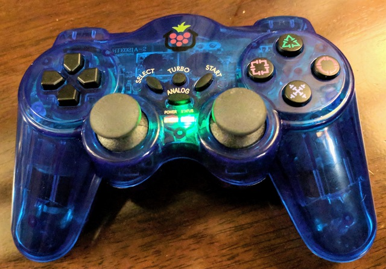

Welcome to Approximate Engineering's Python Game Controller Documentation!
==========================================================================

This library simplifies access to the axes and buttons on game controller hardware from Python. It was originally
written to support my PiWars_ robots, and remains focused on similar projects, but can be used wherever game controller
functionality is required. The current code only supports Linux based systems, including the Raspberry Pi.

.. note::
    Check out the :ref:`changelog-label` to see what's new. In particular, version 2.3 introduces changes to the way
    controllers are discovered and allows for multiple controllers to be used simultaneously. This release also drops
    support for Python2, this and subsequent releases will be Python3 only.

Supported Controllers
---------------------

.. image:: images/ps3.jpg
   :width: 20%

.. image:: images/ps4.jpg
   :width: 20%

.. image:: images/rock-candy.jpg
   :width: 20%

.. image:: images/steam-controller.jpg
   :width: 20%

.. image:: images/wii-pro.jpg
   :width: 20%

.. image:: images/wiimote.jpg
   :width: 20%

.. image:: images/xbox-one.jpg
   :width: 20%

.. image:: images/sf30pro.jpg
    :width: 20%

.. image:: images/spacemousepro.jpg
    :width: 20%

In general you don't need to code to a specific controller, but some may need extra steps when connecting to your Pi or
other computer. In other cases, some controllers offer unique features such as the PS4's light bar. You can see more
details for specific controller types which are non-standard in some way:

 - :ref:`api_dualshock3`

 - :ref:`api_dualshock4`

 - :ref:`api_steamcontroller`

 - :ref:`api_spacemousepro`

Other controller types use standardised names called `snames`, which can be found under simple usage

Contributors
------------

- Tom Oinn (`\@approx_eng <https://twitter.com/approx_eng>`__) wrote and maintains the bulk of this library. Follow me
  for updates!

- Keith Ellis (`\@PiTutorials <https://twitter.com/PiTutorials>`__) contributed initial support for Rock Candy
  controllers.

- Mike Horne (`\@recantha <https://twitter.com/recantha>`__) add support for the PiHut_ controller and an example for
  the :ref:`example_camjam`

- Tom Broughton (`\@dpolymath <https://twitter.com/dpolymath>`__) added support for the SF30Pro controller.

- Clare Macrae (`\@ClareMacraeUK <https://twitter.com/ClareMacraeUK>`__) helped herd the documentation beasts.

Getting the code
----------------

You can install the code using pip, you'll have to add a few native libraries first though:

.. code-block:: bash

    $ sudo apt-get install python-dev python-pip gcc
    $ pip3 install approxeng.input

(The exact dependencies may vary depending on your operating system, they come from using evdev and having to compile
that particular python module against whatever underlying libraries your OS is using). I *strongly* recommend using a
virtual environment (virtualenv) as a general practice.

.. note::

    The controller support code is written in Python, but relies on some underlying operating system functionality which
    is exclusive to Linux based computers like the Pi. As a result, it won't work on Windows or OSX. If you need to
    handle joysticks on those platforms I recommend taking a look at PyGame_, which includes joystick support amongst
    its other functionality.

To work with the code on other platforms you'll want to clone it from GitHub_, it's available under the ASL, the same as
almost everything Python based. Documentation (this site) is generated using Sphinx.

Contents
--------

.. toctree::
    :maxdepth: 4
    :glob:

    changelog
    simpleusage
    commandline
    bluetooth
    profiling
    api
    addingcontrollers
    examples
    howtouse
    sys.rst

.. _GitHub: https://github.com/ApproxEng/approxeng.input

.. _PiWars: http://piwars.org

.. _PyGame: http://pygame.org

.. _PiHut: https://thepihut.com/products/raspberry-pi-compatible-wireless-gamepad-controller